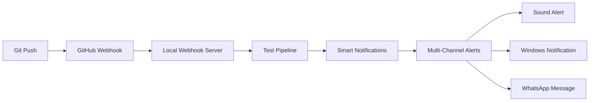

# 📋 CI/CD Pipeline with Smart Notifications - Complete Implementation Guide

**Version**: 1.0  
**Last Updated**: September 2025  
**Author**: Claude Code Implementation  
**Target**: Node.js/Express Applications  

---

## 🎯 **Overview**

This guide provides **exact step-by-step instructions** to implement a complete CI/CD pipeline system with intelligent notifications featuring:

- 🔄 **Automated Testing Pipeline** (Unit → Integration → E2E)
- 🎛️ **Smart Notification Filtering** (failures + final success only)
- 🔔 **Multi-Channel Alerts** (Sound + Windows + WhatsApp)
- 📱 **WhatsApp Integration** using existing bot infrastructure
- ⚡ **Real-time Webhooks** with ngrok tunneling

## 📋 **Prerequisites**

✅ Node.js 18+ environment  
✅ npm/yarn package manager  
✅ GitHub repository with webhook access  
✅ ngrok account (free tier sufficient)  
✅ WhatsApp Business API access (optional but recommended)  

---

## 🏗️ **Architecture Overview**



**Key Components:**
1. **GitHub Webhook** → Triggers on push events
2. **Local Webhook Server** → Receives and processes GitHub events
3. **Test Pipeline Runner** → Executes automated testing sequence
4. **Smart Notification System** → Filters and routes notifications
5. **Multi-Channel Dispatcher** → Delivers alerts via multiple channels

---

## 🔧 **Step 1: Core System Setup**

### 1.1 Install Dependencies

```bash
npm install express node-fetch node-notifier
```

### 1.2 Environment Configuration

Create `.env` file:
```bash
# Core Configuration
WEBHOOK_PORT=8765
NGROK_AUTHTOKEN=your_ngrok_token_here
PRODUCTION_URL=https://your-domain.com

# GitHub Configuration
GITHUB_WEBHOOK_SECRET=your_webhook_secret
GITHUB_REPO=username/repository

# WhatsApp Configuration (Optional)
WHATSAPP_ACCESS_TOKEN=your_token
WHATSAPP_PHONE_NUMBER_ID=your_phone_id
TECH_LEAD_PHONE=recipient_number

# Notification Settings
ENABLE_SOUND_ALERTS=true
ENABLE_WINDOWS_NOTIFICATIONS=true
ENABLE_WHATSAPP_NOTIFICATIONS=true
```

---

## 🚀 **Step 2: Implement Webhook Server**

### 2.1 Create Webhook Server (`src/webhook-server.js`)

```javascript
#!/usr/bin/env node

import express from 'express';
import { spawn } from 'child_process';
import fetch from 'node-fetch';
import fs from 'fs/promises';
import path from 'path';
import { fileURLToPath } from 'url';
import notifier from 'node-notifier';

const __filename = fileURLToPath(import.meta.url);
const __dirname = path.dirname(__filename);

class CICDWebhookServer {
  constructor() {
    this.app = express();
    this.port = process.env.WEBHOOK_PORT || 8765;
    this.ngrokProcess = null;
    this.currentTunnel = null;
    this.testResults = {
      unit: null,
      integration: null,
      e2e: null,
      lint: null
    };
  }

  async start() {
    console.log('🚀 Starting CI/CD Webhook Server...');
    
    this.setupRoutes();
    await this.startServer();
    await this.startNgrok();
    
    console.log('\n✅ CI/CD System Ready!');
    console.log(`🌐 Local: http://localhost:${this.port}`);
    console.log(`🔗 Public: ${this.currentTunnel}`);
    console.log('🎯 Listening for GitHub webhooks...\n');
  }

  setupRoutes() {
    this.app.use(express.json());
    
    // Main webhook endpoint
    this.app.post('/ci-webhook', async (req, res) => {
      try {
        await this.processGitHubWebhook(req.body);
        res.json({ success: true });
      } catch (error) {
        console.error('❌ Webhook processing failed:', error);
        res.status(500).json({ error: error.message });
      }
    });
    
    // Health check
    this.app.get('/health', (req, res) => {
      res.json({ 
        status: 'healthy',
        tunnel: this.currentTunnel,
        timestamp: new Date().toISOString() 
      });
    });
  }

  async processGitHubWebhook(payload) {
    if (payload.ref !== 'refs/heads/master' && payload.ref !== 'refs/heads/main') {
      console.log('⏭️ Ignoring non-main branch push');
      return;
    }

    console.log('\n📦 New Push Detected!');
    console.log(`👤 Author: ${payload.head_commit.author.name}`);
    console.log(`💬 Message: ${payload.head_commit.message}`);
    console.log(`🔗 Commit: ${payload.head_commit.id.substring(0, 7)}`);
    
    // Reset test results
    this.testResults = { unit: null, integration: null, e2e: null, lint: null };
    
    // Run test pipeline
    await this.runTestPipeline();
    
    // Send smart notifications
    await this.sendSmartNotifications();
  }

  async runTestPipeline() {
    console.log('\n🔄 Starting Test Pipeline...');
    
    const tests = [
      { name: 'lint', command: 'npm run lint', key: 'lint' },
      { name: 'unit', command: 'npm test', key: 'unit' },
      { name: 'integration', command: 'npm run test:integration', key: 'integration' },
      { name: 'e2e', command: 'npm run test:e2e', key: 'e2e' }
    ];

    for (const test of tests) {
      console.log(`\n🧪 Running ${test.name} tests...`);
      
      try {
        const result = await this.runCommand(test.command);
        this.testResults[test.key] = { success: true, output: result };
        console.log(`✅ ${test.name} tests passed`);
        
      } catch (error) {
        this.testResults[test.key] = { success: false, error: error.message };
        console.log(`❌ ${test.name} tests failed`);
        
        // Send immediate failure notification
        await this.sendFailureNotification(test.name, error.message);
        
        // Stop pipeline on first failure
        return;
      }
    }
    
    console.log('\n🎉 All tests passed!');
  }

  async sendSmartNotifications() {
    const failures = Object.entries(this.testResults)
      .filter(([_, result]) => result && !result.success);
    
    const successes = Object.entries(this.testResults)
      .filter(([_, result]) => result && result.success);
    
    // Only send final notification if ALL tests passed
    if (failures.length === 0 && successes.length > 0) {
      await this.sendSuccessNotification();
    }
    
    // Individual failure notifications already sent during pipeline
  }

  async sendFailureNotification(testType, error) {
    const message = `❌ CI/CD: ${testType} tests failed\n${error.substring(0, 100)}...`;
    
    // Sound alert
    if (process.env.ENABLE_SOUND_ALERTS === 'true') {
      console.log('🔊 Playing failure sound...');
      // Implementation depends on OS
    }
    
    // Windows notification
    if (process.env.ENABLE_WINDOWS_NOTIFICATIONS === 'true') {
      notifier.notify({
        title: 'CI/CD Pipeline Failed',
        message: `${testType} tests failed`,
        sound: true,
        wait: false
      });
    }
    
    // WhatsApp notification
    if (process.env.ENABLE_WHATSAPP_NOTIFICATIONS === 'true') {
      await this.sendWhatsAppNotification(message);
    }
  }

  async sendSuccessNotification() {
    const passedTests = Object.keys(this.testResults).filter(
      key => this.testResults[key] && this.testResults[key].success
    );
    
    const message = `✅ CI/CD: All tests passed!\n🧪 Completed: ${passedTests.join(', ')}`;
    
    // Sound alert
    if (process.env.ENABLE_SOUND_ALERTS === 'true') {
      console.log('🎵 Playing success sound...');
      // Implementation depends on OS
    }
    
    // Windows notification
    if (process.env.ENABLE_WINDOWS_NOTIFICATIONS === 'true') {
      notifier.notify({
        title: 'CI/CD Pipeline Success',
        message: 'All tests passed!',
        sound: true,
        wait: false
      });
    }
    
    // WhatsApp notification
    if (process.env.ENABLE_WHATSAPP_NOTIFICATIONS === 'true') {
      await this.sendWhatsAppNotification(message);
    }
  }

  async sendWhatsAppNotification(message) {
    if (!process.env.WHATSAPP_ACCESS_TOKEN) {
      console.log('⚠️ WhatsApp notifications disabled (no token)');
      return;
    }
    
    try {
      const response = await fetch(
        `https://graph.facebook.com/v17.0/${process.env.WHATSAPP_PHONE_NUMBER_ID}/messages`,
        {
          method: 'POST',
          headers: {
            'Authorization': `Bearer ${process.env.WHATSAPP_ACCESS_TOKEN}`,
            'Content-Type': 'application/json'
          },
          body: JSON.stringify({
            messaging_product: 'whatsapp',
            to: process.env.TECH_LEAD_PHONE,
            type: 'text',
            text: { body: message }
          })
        }
      );
      
      if (response.ok) {
        console.log('📱 WhatsApp notification sent');
      } else {
        console.log('⚠️ WhatsApp notification failed');
      }
    } catch (error) {
      console.log('⚠️ WhatsApp error:', error.message);
    }
  }

  async runCommand(command) {
    return new Promise((resolve, reject) => {
      const process = spawn(command, { shell: true, stdio: 'pipe' });
      let output = '';
      let error = '';
      
      process.stdout.on('data', (data) => {
        output += data.toString();
      });
      
      process.stderr.on('data', (data) => {
        error += data.toString();
      });
      
      process.on('close', (code) => {
        if (code === 0) {
          resolve(output);
        } else {
          reject(new Error(error || `Command failed with code ${code}`));
        }
      });
    });
  }

  async startServer() {
    return new Promise((resolve) => {
      this.app.listen(this.port, () => {
        console.log(`✅ Webhook server listening on port ${this.port}`);
        resolve();
      });
    });
  }

  async startNgrok() {
    return new Promise((resolve, reject) => {
      console.log('🔗 Starting ngrok tunnel...');
      
      this.ngrokProcess = spawn('ngrok', [
        'http',
        this.port,
        '--authtoken', process.env.NGROK_AUTHTOKEN
      ], { stdio: 'pipe' });
      
      this.ngrokProcess.stdout.on('data', (data) => {
        const output = data.toString();
        const urlMatch = output.match(/https:\/\/[a-zA-Z0-9-]+\.ngrok-free\.app/);
        
        if (urlMatch) {
          this.currentTunnel = urlMatch[0];
          console.log(`✅ Ngrok tunnel: ${this.currentTunnel}`);
          resolve();
        }
      });
      
      setTimeout(() => {
        if (!this.currentTunnel) {
          reject(new Error('Ngrok failed to start'));
        }
      }, 30000);
    });
  }
}

// Start the server
const server = new CICDWebhookServer();
server.start().catch(console.error);
```

---

## 🔔 **Step 3: Configure GitHub Webhook**

### 3.1 Set Up Repository Webhook

1. Go to your GitHub repository
2. Navigate to **Settings > Webhooks > Add webhook**
3. Configure:
   - **Payload URL**: `https://your-ngrok-url.ngrok-free.app/ci-webhook`
   - **Content type**: `application/json`
   - **Secret**: Your webhook secret from `.env`
   - **Events**: Select "Just the push event"
   - **Active**: ✅ Checked

### 3.2 Test Webhook Configuration

```bash
# Test webhook endpoint
curl -X POST http://localhost:8765/health

# Expected response:
# {"status":"healthy","tunnel":"https://abc123.ngrok-free.app","timestamp":"2025-01-15T10:30:00.000Z"}
```

---

## 🧪 **Step 4: Configure Test Scripts**

Add to your `package.json`:

```json
{
  "scripts": {
    "test": "vitest run",
    "test:integration": "vitest run tests/integration",
    "test:e2e": "playwright test",
    "lint": "eslint src --ext .js,.ts",
    "ci:webhook": "node src/webhook-server.js"
  }
}
```

---

## 🎯 **Step 5: Usage & Testing**

### 5.1 Start the CI/CD System

```bash
# Start webhook server
npm run ci:webhook

# In another terminal, make a test commit
git add .
git commit -m "test: trigger CI/CD pipeline"
git push origin master
```

### 5.2 Expected Behavior

**On Push:**
1. 📦 GitHub webhook triggers
2. 🔄 Test pipeline starts
3. 🧪 Tests run in sequence: lint → unit → integration → e2e
4. ❌ **Failure**: Immediate notification (sound + Windows + WhatsApp)
5. ✅ **Success**: Final notification only after ALL tests pass

**Smart Notification Logic:**
- ❌ **Failures**: Instant alerts with error details
- ✅ **Success**: Single notification only when everything passes
- 🔇 **No spam**: No intermediate success notifications

---

## 🛠️ **Step 6: Advanced Configuration**

### 6.1 Custom Sound Alerts

**Windows:**
```javascript
import { spawn } from 'child_process';

// Success sound
spawn('powershell', ['-c', '(New-Object Media.SoundPlayer "C:\\Windows\\Media\\chimes.wav").PlaySync()']);

// Failure sound
spawn('powershell', ['-c', '(New-Object Media.SoundPlayer "C:\\Windows\\Media\\chord.wav").PlaySync()']);
```

**macOS:**
```javascript
// Success sound
spawn('afplay', ['/System/Library/Sounds/Glass.aiff']);

// Failure sound
spawn('afplay', ['/System/Library/Sounds/Sosumi.aiff']);
```

### 6.2 WhatsApp Template Messages

```javascript
// Success template
const successTemplate = {
  messaging_product: 'whatsapp',
  to: process.env.TECH_LEAD_PHONE,
  type: 'template',
  template: {
    name: 'ci_success',
    language: { code: 'en' },
    components: [{
      type: 'body',
      parameters: [
        { type: 'text', text: 'master' },
        { type: 'text', text: '4 tests' }
      ]
    }]
  }
};

// Failure template
const failureTemplate = {
  messaging_product: 'whatsapp',
  to: process.env.TECH_LEAD_PHONE,
  type: 'template',
  template: {
    name: 'ci_failure',
    language: { code: 'en' },
    components: [{
      type: 'body',
      parameters: [
        { type: 'text', text: 'unit tests' },
        { type: 'text', text: 'TypeError: Cannot read property...' }
      ]
    }]
  }
};
```

---

## 🔧 **Troubleshooting**

### Common Issues

**1. Ngrok tunnel not starting**
```bash
# Check ngrok installation
ngrok version

# Verify authtoken
ngrok config check
```

**2. GitHub webhook 401/403 errors**
```bash
# Verify webhook secret matches
echo $GITHUB_WEBHOOK_SECRET

# Check webhook payload in GitHub settings
```

**3. WhatsApp notifications failing**
```bash
# Test WhatsApp API directly
curl -X POST "https://graph.facebook.com/v17.0/YOUR_PHONE_ID/messages" \
  -H "Authorization: Bearer YOUR_TOKEN" \
  -H "Content-Type: application/json" \
  -d '{"messaging_product": "whatsapp", "to": "YOUR_PHONE", "type": "text", "text": {"body": "Test"}}'
```

### Debug Mode

Set environment variable:
```bash
DEBUG=true npm run ci:webhook
```

---

## ✅ **Validation Checklist**

- [ ] ✅ Webhook server starts successfully
- [ ] 🔗 Ngrok tunnel establishes connection
- [ ] 📦 GitHub webhook triggers on push
- [ ] 🧪 Test pipeline runs in correct sequence
- [ ] ❌ Failure notifications sent immediately
- [ ] ✅ Success notification sent only after all tests pass
- [ ] 🔊 Sound alerts work on your OS
- [ ] 🖥️ Windows notifications display
- [ ] 📱 WhatsApp messages deliver (if configured)

---

## 🚀 **Next Steps**

1. **Production Setup**: Configure on dedicated server
2. **Monitoring**: Add logging and metrics
3. **Scaling**: Support multiple repositories
4. **Security**: Add webhook signature verification
5. **Integration**: Connect with deployment pipelines

---

**🎯 Result**: You now have a complete, intelligent CI/CD notification system that eliminates noise while keeping you instantly informed of critical events!
